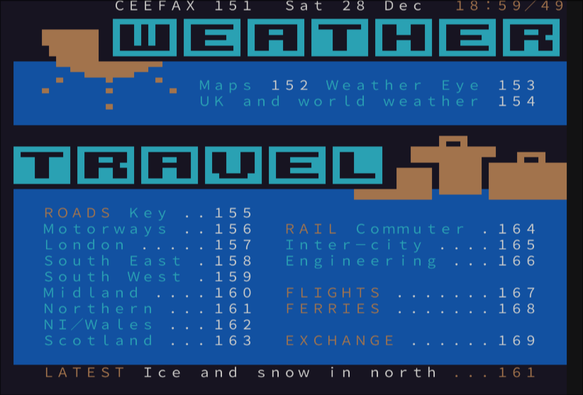

# ttx42

Decode CEEFAX-era Level 1 broadcast teletext into a reusable 25×40 cell grid,
then render it with ordinary ANSI terminal colours.




```rust
let page = ttx42::Page::from_raw(&bytes)?;
let grid = ttx42::decode(&page, &ttx42::DecodeOptions::default());
print!("{}", ttx42::to_ansi(&grid, &ttx42::AnsiOptions::default()));
```

For a complete carousel, `Service::parse_tti` retains ordered pages,
subpages, Fasttext links and vendor records, and `Service::to_tti` writes a
canonical CRLF TTI document. Graphical consumers can use `present` instead of
parsing ANSI; it returns glyph spans plus colour, flash and conceal metadata.
The authoring-side `compile_visual_row` converts styled cells into genuine
Level 1 control-code rows and reports every display cell it had to sacrifice.

The `ttx42` command reads raw 960/1000-byte pages, MRG `.tti` files and
42-byte packet `.t42` recoveries. It reads stdin when no file (or `-`) is
given:

```text
ttx42 page.tti
ttx42 recovery.t42 --page 100 --subpage 1 --reveal
ttx42 page.bin --separated braille
ttx42 page.bin --narrow
```

For T42 input containing multiple transmissions, running without `--page` or
`--subpage` lists the recovered page and subpage numbers in hexadecimal,
including repeated transmissions. Either selector switches to rendering;
selectors may be combined and their values are hexadecimal.

When multiple pages or transmissions match, the CLI renders the one with the
most visible non-space decoded cells; ties select the last match in input
order. This also applies to multi-page TTI files. Transmissions are not merged.
Use `--format raw|tti|t42` to override automatic format detection.

Separated mosaics default to widely-supported braille. Its bottom dot row is
repeated to give the 2×3 teletext mosaic a better terminal aspect ratio.
Contiguous legacy sextants and Unicode 16 separated sextants are selectable. Double
height and flash remain explicit cell metadata so graphical consumers can
render or animate them properly.

Terminal output is 80 columns wide by default. Double-height text uses a
two-row 4×8 octant font derived from the original Mullard SAA5050 character
ROM and generated by
[`sn8kfonts`](https://github.com/bitplane/sn8kfonts); use `--narrow` for a
compact 40-column fallback.

## Specimen

Run `cargo run --example specimen -- --wide` for a small built-in page, or
render a recovery with `ttx42 recovery.t42 --page 188 --wide`.

## Corpus

Run `./corpus/fetch.sh` to download a public recovery sample (about 23 MB),
then `cargo test --test corpus -- --ignored` to run the corpus smoke test.
The fetch script is tracked; downloaded samples are gitignored. Fetching
requires `curl` and an internet connection.

## Prior art and authoring

The dormant Rust [`teletext`](https://crates.io/crates/teletext) decoder and
its `ttxcat` CLI by Vilcans are prior art. For browser-based authoring see
[edit.tf](https://edit.tf/) and the [ZXNet teletext editor](https://zxnet.co.uk/teletext/editor/).

## Scope

This release targets UK Level 1 pages. Level 1.5/2.5/3.5 enhancements and
additional national subsets are intentionally out of scope.

## License

WTFPL.
